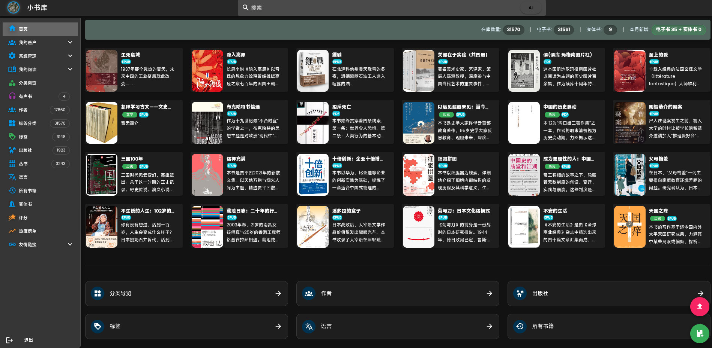
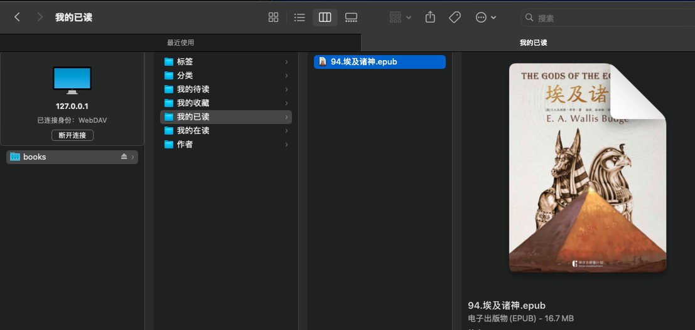
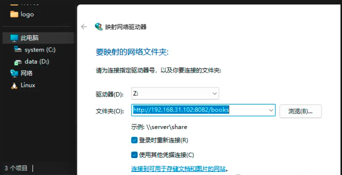

# TaleBook: Personal Calibre WebServer
[](https://github.com/poxenstudio/mybooks/blob/master/LICENSE)
[](https://hub.docker.com/r/poxenstudio/mybooks)


An enhanced personal books management webserver built on Calibre + Vue, beautiful and easy-to-use. ([English](document/README.en.md))

## 简单好用的个人图书管理系统
本项目专注于个人及家庭私有电子书、实体书管理，以及多账号的阅读管理，不适用于站点搭建。后续目标是结合AI提供更多的扩展阅读内容，形成个人的知识库。


本系统与电子书阅读器不同，主要功能在于对电子书的管理功能。阅读器可以灵活选择，移动端比较多，在PC端推荐Koodo Reader。

**友情提醒：中国境内网站，个人是不允许进行在线出版的，维护公开的书籍网站是违法违规的行为！建议仅作为个人使用！**

### 项目介绍
从v3.45.0开始，此项目从PoxenStudio/Talebook改名为MyBooks, 避免与talebook/talebook混淆。

MyBooks特性包括:
* 支持WAP简版页面，供精简浏览器访问
* 支持监听导入目录并自动导入新书
* 支持提供Podcast服务，让书库变播客
* 支持以WebDAV连接及数据同步
* 支持推送到支持Wifi传书的设备及Kindle上
* 支持自定义分类
* 支持添加实体书
* 支持阅读管理
* 集成epub2audio将epub转换有声书，内置多个中文及英文声音。
* 更新Calibre 7.6，系统使用Ubuntu 24.04
* 支持中文搜索时，使用简繁体同时搜索
* 支持epub、azw3、pdf互转, 支持Word文档入库
* 支持将图书指定为私藏模式，仅有上传者可见
* UI风格美化 - 增加暗黑模式
* 支持切换不同图标，支持设置用户头像
* 阅读器支持颜色样式切换，字体切换(提供4个内置字体)

扩展工具：
* 在Chromium系列浏览器，包括Chrome和Edge中安装扩展，可以快速方便进行查询和电子书上传，详情见[MyBooks Browser Extension](https://github.com/poxenstudio/extensions)。
* 在AI工具，如OpenClaw、QClaw中集成[MyBooks Skill](https://clawhub.ai/poxenstudio/mybooks)[之前为Talebook Skill]。

目前提供的能力如下：


### 致谢
我们自2025年6月开始基于[talebook v25.06.26](https://github.com/talebook/talebook)开发，感谢Rex等几位朋友贡献的优秀项目和前后端框架，也要感谢Calibre项目提供了强大的电子书管理的核心功能。本项目仍然会坚持开源免费, 遵循项目的开源协议，期望能持续成为书友们的好帮手。


### Web API
[Web API文档](document/WebAPI.md)

### 关注项目
公众号```Talebook```


## Docker

部署比较简单，建议采用docker，镜像地址：[dockerhub](https://hub.docker.com/r/poxenstudio/mybooks)
* 已经调整基于```Ubuntu 24.04```和```Calibre 7.6```构建, 改善兼容性。Docker运行的UID/GID不要设置为```root```(ID:0)。

推荐使用`docker-compose`，下载仓库中的配置文件[docker-compose.yml](docker-compose.yml)，然后执行命令启动即可。
若希望修改挂载的目录或端口，请修改docker-compose.yml文件。

```
wget https://raw.githubusercontent.com/PoxenStudio/mybooks/master/docker-compose.yml
docker-compose -f docker-compose.yml  up -d
```

如果使用原生docker，那么执行命令：
`docker run -d --name mybooks -p <本机端口>:80 -v <本机data目录>:/data poxenstudio/mybooks`


例如
`docker run -d --name mybooks -p 8080:80 -v /tmp/demo:/data poxenstudio/mybooks`

## Windows安装
自v3.47起提供在Windows 10之后版本上独立的安装程序，不依赖Docker。可以在各个release的附件中下载。
[Wins Installer](document/win_installer.png)
安装后可以会出现```MyBooks Service```程序, 提供停止、重启和卸载操作。
启动后，服务通过本机ip可以访问。
[windows_service](document/win_service.png)

数据目录在当前用户的AppData/Local目录下， 可以直接查看。

## 使用WebDAV连接
WebDAV URL地址: `http://<ip or domain>:<port>/books`
* macOS下
在`连接到服务器`输入对应的URL进行连接:


* Windows下
如果未配置https, 需要先将WebClient修改为支持HTTP协议：
```
1. 打开注册表, (运行->输入regedit)
2. 找到 HKEY_LOCAL_MACHINE\SYSTEM\CurrentControlSet\Services\WebClient\Parameters, 将BasicAuthLevel改为2
3. 以超级管理员身份运行PowerShell, 先入输入net stop webclient 和 net start webclient.
```
然后通过`映射网络驱动器`连接到指定URL：

访问列表:


## 使用MCP Service
从v3.15.0开始，支持MCP服务，可以集成到AI工具中使用。现在使用流程会提示提供账号信息进行登录，然后才能正常使用。
```
{
  "mcpServers": {
    "talebook": {
      "type": "streamableHttp",
      "url": "http://<ip>:<port>/api/mcp/stream",
      "description": "Local ebooks management system"
    }
  }
}
```

## 使用Skill操作书库
详情见[MyBooks Skill](https://clawhub.ai/poxenstudio/mybooks)。
旧的[Talebook Skill](https://clawhub.ai/poxenstudio/talebook)。

## 常见问题

常见问题请参阅[使用指南](document/UserGuide.zh_CN.md)，无法解决的话，提个ISSUE, 或进入公众号私信。

手动安装请参考[开发者指南](document/Development.zh_CN.md)

**再次声明！本项目没有维护任何公开的书库站点。**


## 贡献者
[](https://github.com/PoxenStudio/mybooks/graphs/contributors)


## 项目首页
[PoxenStudio MyBooks](https://mybooks.top)

## 联系邮箱
📧 [poxenstudio@gmail.com](mailto:poxenstudio@gmail.com)